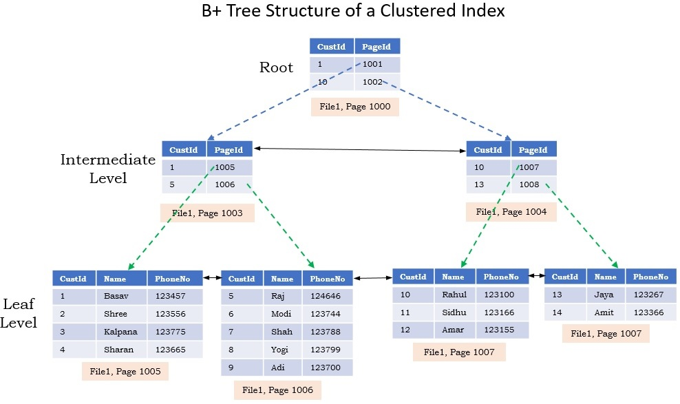
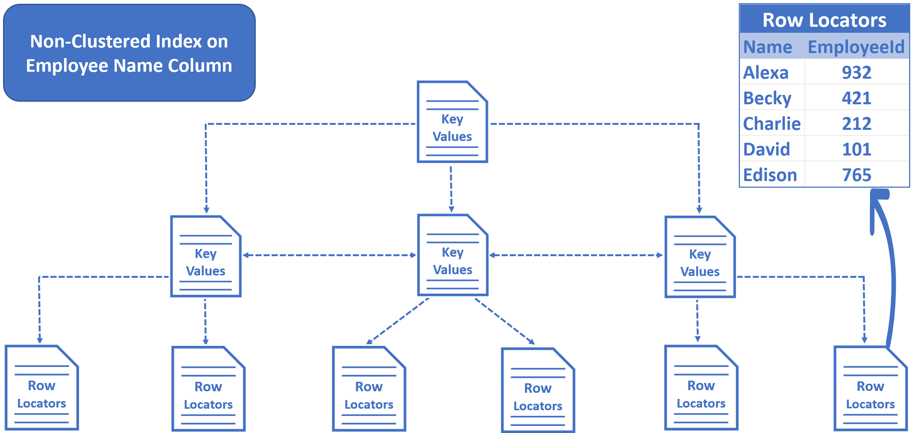

# Seminar 5 - Indexes in SQL Server

## Table of Contents
- [Introduction](#introduction)
- [Characteristics of indexes](#characteristics-of-indexes)
- [Clustered vs Nonclustered](#clustered-vs-nonclustered)
    - [Clustered](#clustered)
    - [Nonclustered](#nonclustered)
- [Unique indexes](#unique-indexes)
- [Key/NON-Key columns](#keynon-key-columns)
- [Filtered indexes](#filtered-indexes)
- [Indexes for deletes](#indexes-for-deletes)
- [Index design](#index-design)


## Introduction
- structure stored on the disk
- associated to a table or view

```sql
CREATE [UNIQUE] [CLUSTERED | NONCLUSTERED] INDEX index_name
ON <obj> (col1 [ASC | DESC], col2, ...) -- key columns
INCLUDE (colA, colB, ...) -- non-key columns
WHERE condition
WITH (<index_option1>, <index_option2>, ...)
```

## Characteristics of indexes
- clustered / nonclustered (cl./noncl.)
- unique / nonunique
- search key single column / multi column
- key / non-key columns
- cols. order ASC / DESC
- (for noncl.) filtered index

## Clustered vs Nonclustered
### Clustered:
- data rows are stored based on the search key columns
- high degree of uniqueness
- for frequently executed queries
- can be used for range queries
- cols from search key: 
    - narrow
    - unique
    - not frequently changed
- at most 1 cl. index per table
- search key 
    - 900 bytes max
    - 32 cols max

```sql
CREATE CLUSTERED INDEX idx_name
ON Schema.Table (col1, col2)
```


### Nonclustered:
- contains key values and RIDs (pointers to data rows) = record id
- RIDs:
    - heap table RID - no page, record no.
    - clustered table RID - value for the cl. index
- physical order independent from the non cl. index order
- at most 999 noncl. indexes per table
- search key 1700 bytes max

```sql
CREATE INDEX idx_name
ON Schema.Table (col1, col2)
```


## Unique indexes
- search key cols -> do not allow duplicate values
- unique cols -> useful info for query optimizer:
    cols with UNIQUE constraint -> ncl. unique index

## Key/NON-Key columns
- improving efficiency of queries -> no key lookup
- covering index
- non-key cols. 
    - accessed with the index
    - data types: text, varchar(MAX)
    - do not count for the size of the index

## Filtered indexes
- optimize non-clustered indexes
- recommended when frequently accessing a subset of the data

+smaller index size  
+better query performance

## Indexes for deletes
- indexes on FK can improve the performance of DELETE operations
```sql
ALTER INDEX idx_name 
ON Schema.Table(col1, col2)
DISABLE|REBUILD
```

Useful system views:
- `sys.indexes` 
- `sys.helpindex`
- `sys.dm_db_index_usage_stats`
- `sys.dm_db_index_physical_stats`

## Index design
DB aspects:
- having many indexes per table -> decrease performance
- useless indexes on small tables

Query aspects:
- covering indexes
- ncl. indexes on `WHERE` and `JOIN` conditions
- group records in a single stmt

Column-related aspects:
- len. of the search key as small as possible
- cl. indexes are recommended to be created on UNIQUE & NOT NULL cols
- column uniqueness
- filtered indexes - subset of data well-defined
- order of key columns - start with columns that appear in: 
    - `=`
    - `>`, `<`
    - `BETWEEN`
- indexes on computed columns

## Examples

### 1. Clustered index on a table
```sql
CREATE CLUSTERED INDEX letterDateIndex
ON Letters (letterDate)
```

### 2. Nonclustered index on a table
```sql
CREATE INDEX ageIndex
ON Children (age)
```

### 3. Key lookup
```sql
SELECT *
FROM Letters
WHERE letterDate BETWEEN '2019-01-01' AND '2019-12-31'
-- clustered index scan
```

### 4. unique indexes
```sql
CREATE UNIQUE INDEX presentIndex
ON Presents (pname)

SELECT *
FROM Presents
WHERE pname = 'doll'
-- nonclustered index seek + key lookup
```

### 5. Multicolumn index
```sql
SELECT *
FROM Letters
WHERE cId = 1 AND pId = 2
-- clustered index scan

CREATE INDEX lettersIndex
ON Letters (cId, pId)

SELECT *
FROM Letters
WHERE cId = 1 AND pId = 2
-- nonclustered index seek
```

### 6. Covering index
```sql
DROP INDEX letterDateIndex
ON Letters

SELECT *
FROM Children
WHERE age = 5
-- clustered index scan

CREATE INDEX indexChildrenAge
ON Children (age) 
INCLUDE (name, address)

SELECT *
FROM Children
WHERE age = 5
-- nonclustered index seek
```

### 7. Inner join indexes
```sql
CREATE CLUSTERED INDEX indexLetters
ON Letters (cId)

SELECT *
FROM Children
JOIN Letters ON Children.cId = Letters.cId
-- clustered index scan