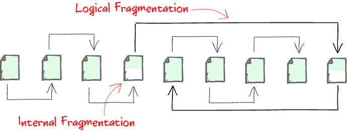

# Seminar 7

## Table of contents
1. [Indexing rules](#indexing-rules)
2. [Indexed views](#indexed-views)
3. [Fragmentation](#fragmentation)

## Indexing rules
- 1 clustered index / table
- clustered index key should be 
    - increasing
    - static
    - selective
    - small
- non-clustered indexes on:
    - columns from WHERE clause
    - FK columns
- covering indexes - on the most frequent queries
- NOT recommended to have 1 index per each column  
    (because each time we insert a row, we have to update all indexes)
- multi-column indexes - most "unique" column first

## Indexed views
### Restrictions:
1. Options:  
(ON is the default value)  
    a) ANSI_NULLS ON  
    b) ANSI_PADDING ON  
    c) ANSI_WARNINGS ON  
    d) ARITHABORT ON  
    e) CONCAT_NULL_YIELDS_NULL ON  
    f) NUMERIC_ROUNDABORT OFF  
    g) QUOTED_IDENTIFIER ON  

a)  
- col is NULL (ON)  
- col = NULL (OFF)

b) deleteing trailing spaces (by default not)

c)
- ON 
    - warning for NULL for MIN, MAX, COUNT
    - error for division by 0
    - error for updating/inserting data that exceeds the data type limit
- OFF
    - no warning ...
    - warning ...
    - warning ...

d) arithmetical overflow  

- ON - error
- OFF - NULL

e) NULL + 'abc' = NULL (ON)

f) 
- OFF - no warning for truncations of decimal
- ON - warning

g)
- ON - " " -> object names (create table "having")
- OFF - " " -> string

<br><br>

2. names - two part format:  
e.g.  
    - schema_name.table_name
    - schema_name.view_name

3. index clustered + unique (schema)
4. with schemabinding (on view)
5. SELECT Stmt 
- NOT: 
    - ORDER BY, DISTINCT, TOP, HAVING, other views, subqueries, outer joins, set operators etc.
    - MAX, MIN, AVG
6. all the view should be deterministic
7. functions should be deterministic
8. COUNT -> COUNT_BIG
9. SUM(expr) -> should NOT be NULL


### Example:
```sql
CREATE OR ALTER VIEW dbo.viewName
WITH SCHEMABINDING
AS
    SELECT col1, COUNT_BIG(*) as cnt, SUM(ISNULL(col2, 0)) as sumSalaries
    FROM dbo.tableName
        INNER JOIN dbo.tableName2 ON ...
    GROUP BY col1
GO
```


## Fragmentation
### Types:
    - internal fragmentation - data not stored in contiguous memory (we can have free spaces within a datapage)
    - extent fragmentation - groups of 8 contiguous datapages
    - logical fragmentation - records are not stored in the order of the index key
        - when inserting a new row, the row is inserted in the first available datapage
        - if no space, a new datapage is created



- how to check fragmentation:
```sql
SELECT * FROM sys.dm_db_index_physical_stats
(DB_ID(), OBJECT_ID('dbo.tableName'), NULL, NULL, 'DETAILED')
```
- avg_fragmentation_in_percent
    - extent fragmentation (heap)
    - logical fragmentation (cl index table)
- avg_page_space_used_in_percent

### Reducing fragmentation:
- heap - create index + drop index
- cl index table:
    - avg_fragmentation_in_percent 5% < avg < 30%
        ```sql
        ALTER INDEX REORGANIZE
        ```
    - avg_fragmentation_in_percent > 30%
        ```sql
        ALTER INDEX REBUILD
        ```
        or
        ```sql
        DROP INDEX + CREATE INDEX
        ```

    - make an index with a fill factor
        ```sql
        CREATE INDEX
        ...
        WITH (FILLFACTOR = 70)
        ```

    
## Control of Flow Language
- IF/ELSE
- WHILE
- GOTO
- BEGIN/END
- BREAK
- CONTINUE
- RETURN --> in stored procedures - returns a status code (0 - ok, >0 - error)
- THROW
    - THROW {error_number}(>50000) {message} {state}(0-255)
    - RAISEERROR({message}, {severity}(0-25), {state}) - function
    - get info about the error - ERROR_NUMBER(), ERROR_MESSAGE(), ERROR_STATE(), ERROR_SEVERITY(), ERROR_LINE(), ERROR_PROCEDURE()
- TRY/CATCH
- WAITFOR
    - WAITFOR DELAY '00:00:05' - wait for 5 seconds
    - WAITFOR TIME '12:00:00' - wait until 12:00